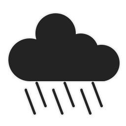

# DCS Real Weather

DCS Real Weather is  program meant to be incorporated into a DCS server's
restart cycle. The utility fetches the most recent weather report (METAR) from
a selected airport and attempts to make the weather conditions inside a
provided mission file match the report. When configured this way, a server can
run a static mission file but regularly update the weather conditions
automatically. The utility can also update time of day based off the current
time and a given offset if desired.

## Documentation and Setup

If using the latest stable release, please see the [release documentation][1].
If using the latest beta version, please see the [development documentation][2].

[1]: https://github.com/evogelsa/dcs-real-weather/blob/main/cmd/realweather/README.md
[2]: https://github.com/evogelsa/dcs-real-weather/blob/dev/cmd/realweather/README.md

## Bot Documentation and Setup

For now, the bot does not have a separate release cycle. All new bot releases
will be paired with Real Weather releases. Please see the bot directory for
its documentation; here's a link for the [latest stable release][3] and
here's a link for the [latest development release][4].

[3]: https://github.com/evogelsa/dcs-real-weather/blob/main/cmd/bot/README.md
[4]: https://github.com/evogelsa/dcs-real-weather/blob/dev/cmd/bot/README.md

## Contributing

Interested in helping to improve this project? Please see the [contributing
guide](CONTRIBUTING.md) for guidelines on making suggestions, opening new
issues, or contributing code. Thanks for your interest!

## Enjoying DCS Real Weather?

Please consider starring the project to show your support. If you
would like to get more involved, read the [contributing guide](CONTRIBUTING.md)
to see how you can improve DCS Real Weather. This started as a small personal
project and has grown to a small user base over the past couple years. Feel
free to spread the love by posting about DCS real weather or by sharing with
friends. Also join our small [Discord](https://discord.com/invite/mjr2SpFuqq)
community for support, announcements, and camaraderie. For those interested in
supporting the project financially, please see the "sponsor" button at the top
of the page for options. Thanks!

